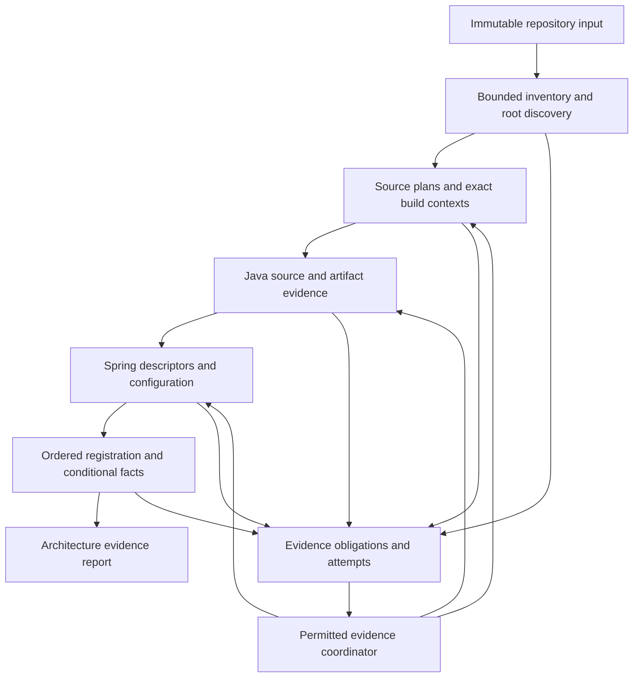

# M4-UNIVERSAL-V2 — Adaptive Repository Understanding

Ngày thiết kế: 2026-09-23; hoàn thiện kế hoạch ba task: 2026-09-26. **CONFIRMED — yêu cầu của chủ dự án:** thêm một task M4 Universal v2, giảm mạnh `UNKNOWN`/`UNRESOLVED`, tiếp nhận repo đa dạng và có kế hoạch riêng cho từng task sắp tới. **PROVISIONAL — thiết kế triển khai dưới đây:** chưa phải năng lực đã được implement hoặc kết quả benchmark.

Đây là task mới sau hai slice Universal v1, trước M4E/G3. Không đổi kết quả lịch sử của M1–M4, không cấp quyền chạy build của repo đầu vào. [Kế hoạch và task files](../tasks/m4-universal-v2/README.md), [ma trận độ bao quát](m4-universal-v2-coverage.md), [protocol nghiệm thu](../research/m4-universal-v2-evaluation.md) là ba phần của hợp đồng này.

## 1. Kết quả người dùng cần nhận

Người dùng đưa một thư mục/snapshot/bundle vào, nhận được ngay kiểm kê phần đã tiếp nhận; sau đó bức tranh module, package, type, dependency, Spring component, injection và entry point được bổ sung dần. Hệ thống chủ động thu thập bằng chứng còn thiếu trong quyền đã cấp. Một file lỗi, một dependency mất hoặc một provider lỗi không làm mất kết quả của phần độc lập.

Mỗi vùng kiến trúc trả lời được: đã biết gì; biết nhờ source/artifact/config nào; điều kiện nào làm nó tồn tại; phần nào còn thiếu; provider nào đã thử; cần bằng chứng cụ thể nào để làm rõ. Báo cáo gom nguyên nhân gốc và phạm vi ảnh hưởng, không chỉ ném ra một tổng số dấu hỏi.

“Universal” có ba nghĩa tách biệt:

| Lớp | Cam kết thiết kế | Không được đánh tráo |
|---|---|---|
| Tiếp nhận | Mọi hình dạng repo đi vào một quy trình có kết quả kết thúc rõ ràng, trong giới hạn tài nguyên công bố | Nhận tên file không có nghĩa đã phân tích ngữ nghĩa file |
| Độ sâu | Dùng các provider phù hợp để giải nhiều câu hỏi kiến trúc nhất với bằng chứng hiện có | `PARTIAL`, candidate hoặc heuristic không được đổi nhãn thành `RESOLVED` |
| Chất lượng | Đo đúng/sai, bao quát, thiếu bằng chứng, khả năng vận hành và ích lợi kiến trúc riêng biệt | Không suy ra “99% mọi repo thế giới” từ số test hoặc một corpus nhỏ |

**CONFIRMED — chủ dự án xác nhận trong trao đổi ngày 2026-09-23:** phân tích sâu Java/Spring toàn diện; kiểm kê và thể hiện ranh giới phần đa ngôn ngữ. Java không bị loại chỉ vì cạnh đó có JS/Python/Kotlin. Phần ngôn ngữ khác có coverage row và ranh giới liên kết có bằng chứng; không có cam kết dựng semantic engine cho mọi ngôn ngữ. Mở rộng ngôn ngữ về sau cần frontend/catalog/oracle/gate riêng; đọc Gradle Kotlin DSL không phải phân tích Kotlin application.

Repo không có Java vẫn có báo cáo kiểm kê và kết quả `NOT_APPLICABLE` cho Java, không crash và không được tính thành thành công phân tích kiến trúc Java. Repo không đọc được có báo cáo thất bại tiếp nhận; repo bị cắt vì quota có frontier chưa duyệt. Không tuyên bố đã biết số file phía sau frontier.

## 2. Khoảng cách từ code hiện tại

**CONFIRMED bằng đọc source và hợp đồng hiện tại, chưa chạy benchmark mới:**

| Hiện trạng | Tác động | Chủ nhiệm task |
|---|---|---|
| `UniversalSourceIngestion` cần `Resolution` do caller cung cấp | Nhận diện Gradle chưa tự tạo được exact classpath | V2.1 |
| `buildClosureUnknown` là cờ chung; một số vấn đề build có thể chặn nhiều source set | Cần chứng minh phạm vi tác động để giữ lại module độc lập | V2.1 |
| `UniversalIngestionPipeline` giữ frontend/component khi enrichment lỗi nhưng không có durable supervisor | Chưa đủ chống worker chết, timeout, OOM hay resume | V2.1, V2.3 |
| Library metadata nhận supplied bytes; generated members chưa đảm bảo mọi call site resolve | Nhiều nguyên nhân thiếu symbol/resource vẫn còn | V2.1, V2.2 |
| Structural Spring candidates chưa nối tự động đầy đủ sang M4C descriptors/schedule | Có các provider riêng chưa thành luồng input-to-truth hoàn chỉnh | V2.2–V2.3 |
| Ledger/attempt/conflict/gap resolution đã có; normalizer không thực thi provider | Cần coordinator thật, không thêm một bảng lý do thụ động | V2.1 |
| SAT đã có nhưng signature diversity và opaque effects còn làm thiếu bằng chứng | Cần dependency-local reasoning và refinement có chứng minh | V2.2 |

Nguồn: [v1 ingestion](m4u1-passive-ingestion.md), [v1 Spring](m4u2-universal-spring.md), [evidence core](evidence-acquisition.md), [nghiên cứu thiết kế](../research/2026-09-23-m4-universal-v2-design.md).

## 3. Kiến trúc và quyền sở hữu

Các vòng quay là **thu thập bằng chứng và tính lại**, không phải fixed point tùy tiện thay cho thứ tự bean registration của Spring.

| Thành phần | Trách nhiệm và đầu ra | Ranh giới |
|---|---|---|
| Acquisition adapter | Bytes, inventory, denied/unavailable/frontier rows, digest | I/O chỉ trong adapter; không diễn giải domain |
| Build providers | Roots, ownership, source sets, dependencies và exact ordered manifests | Không suy đoán tọa độ từ package; không gộp classpath nhiều context |
| Artifact providers | Generated documents, class metadata, nested resources, lineage | Không class-load/execute target; không giả source span từ bytecode |
| Semantic frontend | Declarations/occurrences/targets và độc lập các trạng thái provenance | JavaParser vẫn primary theo ADR-001 |
| Spring adapters | Annotation/XML/config/type evidence -> M4B/M4C inputs | Candidate, registration, selection, instantiation tách riêng |
| Evidence coordinator | Chọn provider, kiểm quyền, budget, retry, reconcile, invalidation | Không tự cấp quyền; không chứa Maven/Spring/parser internals |
| Reasoner | Truth regions, witness/counter-witness, residual unknown | Dùng schedule/state đã chứng minh; không ghép các thế giới bất khả thi |
| Report projection | Facts, coverage, root causes, phần kiến trúc hữu ích | M5 sở hữu graph/query thật; M7/M8 sở hữu CLI/API/UI sản phẩm |

Monorepo nhiều build root được chia thành các context độc lập. Batch report có thể liệt kê chúng; mỗi kết luận thuộc đúng context. Liên kết giữa các context chỉ là reference có phạm vi khi có artifact/source lineage; federation, chọn biến thể triển khai và universal truth qua mọi build vẫn là horizon riêng.

## 4. Hai đường phân tích cùng tồn tại

1. **Structural discovery:** kiểm kê, decode, parse declarations và quan hệ cú pháp có thể chứng minh tại chỗ. Có thể tiếp tục khi dependency chưa đủ. Tên nhìn thấy ở source là tên được viết, chưa phải resolved target.
2. **Exact semantic analysis:** chỉ tạo request thỏa M1/M3/frontend preconditions; resolve trên classpath, platform, source ownership và generator inputs xác định.

Không làm rỗng classpath rồi gọi đó là exact. Đường structural cần envelope có version riêng nếu port hiện tại không biểu diễn đủ; không nới validation của `FrontendRequest`. Span gắn raw document/decoding và tọa độ thật. Parse recovery không tự tạo declaration/target chắc chắn; region lỗi được giữ trong denominator.

Khi thiếu một module, giữ các sự thật local đã chứng minh, đồng thời lan truyền thiếu bằng chứng qua **dependency footprint**. Chỉ giới hạn ảnh hưởng khi có proof rằng module/fact khác độc lập. Nếu custom plugin/registrar có thể sửa toàn graph mà chưa giới hạn được footprint, giữ ảnh hưởng rộng tương ứng; không “cô lập” bằng phỏng đoán.

## 5. Evidence bundle và identity đề xuất

Tái sử dụng `CapabilityGapRecord`, `EvidenceRequirement`, `AcquisitionAttemptRecord`, `GapResolutionRecord`, `ProviderConflictRecord` và ledger hiện có. Không thêm enum chỉ để đổi tên UNKNOWN. Những envelope sau là **logical design**, V2.1 phải đối chiếu schema trước khi implement:

| Envelope | Trường bắt buộc |
|---|---|
| Repository understanding request | Input selection, discovery policy, enabled providers, permission policy, resource budgets, supplied evidence refs |
| Inventory report | Observed paths/types/hashes, exclusions, unreadable regions, traversal frontier, completion state |
| Evidence bundle | Schema/provider/tool versions, producer identity, snapshot/source-plan/build-context hashes, ordered classpath, artifact hashes, source/generated lineage, config envelope, acquisition trust |
| Provider plan | Requirement IDs, prerequisites, ranked providers, declared effects, budgets, decision proof |
| Evidence revision | Parent revision, added observations/attempts/resolutions/conflicts, affected dependency footprint |
| Understanding report | Input/revision/semantic-context IDs, fact refs, coverage partitions, gaps/root causes, run termination, product readiness |

Bundle có thể chứa model/classpath đã export từ CI của người dùng, generated sources, class directories/JAR/WAR, AOT/config/runtime observations. **Import là đọc dữ liệu**, không phải quyền chạy CI/build/runtime. SHA-256 chứng minh byte identity, không chứng minh producer đáng tin, artifact khớp source hoặc signature đúng; các kiểm tra lineage/trust là riêng. Không đủ lineage thì artifact chỉ là evidence có mức qualification tương ứng, không tự thỏa gap “đúng generated output của snapshot này”.

M1 preimages và artifact lịch sử bất biến. Additive schema/provider versions mới do V2.1 đăng ký với golden tests. Run identity không chứa kết quả do chính nó tạo. Revision mới không sửa observation cũ; thay đổi classpath/source-plan/semantic version tạo context mới và invalidates kết quả phụ thuộc. Không trộn context cũ và mới thành một manifest.

## 6. Bộ điều phối giảm thiếu bằng chứng

Mỗi gap phải được chuyển thành câu hỏi có thể kiểm: “cần annotation defaults của artifact X”, “cần generated constructor của owner Y”, “cần thứ tự registration Z”, không chỉ “thử parser khác”.

Đường chọn mặc định, với tie-break có version và canonical order:

1. Tái sử dụng bằng chứng đã có, khớp identity và còn hợp lệ.
2. Đọc source/build/config/resource nằm trong selection được phép.
3. Đọc supplied bundle, generated output, platform, cache/artifact đã chọn.
4. Acquire chính xác artifact từ endpoint được cấu hình và cho phép; ghi cả unavailable/denied/retry.
5. Áp dụng semantic/version pack hoặc static summary đã kiểm chứng cho câu hỏi này.
6. Ghi yêu cầu evidence bổ sung khi các đường được phép đã cạn; không tự chạy target build.

Registry khai báo requirement kinds, supported input/semantic versions, satisfaction predicate, effects, limit dimensions và replacement trigger. Một provider “thành công” chỉ đóng gap sau khi output vượt kiểm tra digest/context/provenance và predicate của requirement. `NARROWED` khác `SATISFIED`; một evidence có thể giúp nhiều obligations nhưng không tự đóng tất cả.

Ưu tiên lexicographic, không dựa trên điểm confidence tự bịa: prerequisite đang chặn nhiều obligations độc lập -> mức ít xâm lấn -> nhóm chi phí công bố -> requirement/provider identity. Fan-out dựa trên dependency graph thực tế; thứ tự queue không quyết định semantic truth. Không lấy thời gian đo máy hiện tại làm tie-break canonical.

Chống loop: attempt key gồm requirement + provider version + input revision + policy; không lặp lại khi không có input mới. Retry network hữu hạn chỉ cho lỗi transient được phân loại, metadata/output được lưu để replay offline. Dừng ở closure, không còn permitted provider, không có tiến triển về evidence, budget, cancel hoặc lỗi supervisor. Mỗi pending obligation có termination reason.

Reconciliation dựa trên context và proof, không theo “provider sau mạnh hơn”. Evidence mâu thuẫn tạo conflict; các kết quả phụ thuộc bị tính lại hoặc withheld. Số fact chắc chắn có thể giảm khi phát hiện mâu thuẫn: đây là sửa sai có bằng chứng, không che bằng chỉ tiêu coverage.

## 7. Khả năng vận hành và determinism

| Sự cố | Hành vi bắt buộc |
|---|---|
| File decode/parse lỗi | Giữ bytes/hash/coverage row; giữ kết quả file/module độc lập |
| Archive hỏng/bomb/path traversal | Kiểm entry/expanded bytes/depth/path containment; chỉ cách ly archive/entry liên quan |
| Provider ném exception | Typed provider failure, sanitized diagnostic, giữ stage outputs đã checkpoint |
| Worker OOM/stack overflow/deadlock/exit | Supervisor ngoài worker giới hạn tài nguyên, ghi crash/timeout, cho run tiếp tục hoặc kết thúc có checkpoint |
| Coordinator/OS chết hoặc disk đầy | Không hứa xuất report khi host không hoạt động; checkpoint atomic cho resume, kiểm integrity và nêu mất dữ liệu nếu có |
| Repo thay đổi khi đọc | Ghi mutation/conflict; acquire snapshot mới hoặc retry hữu hạn; không ghép bytes ở hai thời điểm |
| Network/auth unavailable | Local/source-only evidence tiếp tục; đúng affected gaps; không đọc credentials ngầm |
| Cancel/quota | Final partial report khi supervisor còn hoạt động; outstanding/frontier rows và resume token |

Không bắt toàn bộ `Throwable` rồi giả vờ JVM còn an toàn. Process isolation phục vụ **provider của analyzer**, không biến target script thành được phép chạy. Workers chạy entry points tin cậy, bounded IPC, không có quyền vượt policy.

Determinism áp dụng cho cùng **captured input closure**, provider/policy versions và deterministic work budgets. Live network, host failure và wall timeout là biến ngoại sinh: acquisition journal được ghi riêng và replay bằng artifact đã capture. Semantic result digest tách runtime timings/host telemetry; cùng source nhưng network acquisition khác không được hứa cùng kết quả. Một wall timeout chưa đạt deterministic cut point không được coi là completed canonical semantic run.

## 8. Spring, configuration và dynamic behavior

V2.2 hoàn thiện cầu nối source/artifact -> condition -> discovery -> ordered registration -> binding -> truth region. Version packs ghi **exact artifact tuple + mechanism subset + oracle evidence**, không whitelist một JAR hash cho toàn bộ năng lực và cũng không coi cùng major là tương đương.

Nhận diện được version mới phải giữ structural evidence, tự chọn pack đã chứng minh tương thích nếu có; phần semantics chưa chứng minh vẫn có gap riêng. Đầu vào Java quá mới/preview/legacy nhận report và alternate-provider requirement, không fail cả repo, không hứa hỗ trợ cú pháp tương lai.

Custom conditions, `ImportSelector`, registrar, `FactoryBean`, BDRPP/BFPP/BPP, reflection, ServiceLoader, SpEL và functional registration có progressive lane: literal/metadata -> bounded pure summary -> supplied generated/AOT/runtime observation. Summary cần grammar/effect bounds, soundness controls và unknown residual. Không chạy method để “thử xem”; observation một lần chạy chỉ nói về run/config đó.

Unknown ảnh hưởng theo dependency slice. Muốn chứng minh opaque action không đổi candidate/order/condition khác phải có effect summary; không có proof thì không thu hẹp ảnh hưởng. SAT dùng finite abstraction đã kiểm chứng và giữ correlation; không độc lập hóa các opaque operands có cùng nguồn. Chi tiết matrix và oracle nằm trong V2.2.

## 9. Nghiệm thu và ưu thế cần chứng minh

Universal v2 hoàn tất khi mọi task acceptance dưới [protocol](../research/m4-universal-v2-evaluation.md) được đánh giá; integration trả kiến trúc có evidence; blockers/denominators không bị giấu. G3 vẫn do M4E adjudication. Mục tiêu 98–99% được giữ làm **mục tiêu thực nghiệm trên corpus đã đăng ký**, không làm nhãn hiện trạng hoặc số cam kết trên internet.

Ưu thế cần đo: ít phụ thuộc thao tác setup, coverage đúng ở repo thiếu build, recovery tốt, ít false certainty, trace source-to-architecture và configuration-qualified facts tốt. “Tốt hơn tool trên thị trường” chỉ được công bố cho từng nhiệm vụ/baseline/version/input mode đã chạy công bằng. Không suy luận chất lượng security/dataflow của đối thủ từ kết quả architecture benchmark.

## 10. Exit và handoff

Đầu ra bắt buộc: provider implementations + compact fixtures + additive schema/catalog controls + coordinator/recovery evidence + reason-level uncertainty deltas + architecture report examples + registered M4E package. Không cần một UI mới trong M4 để chứng minh orchestration; M5/M7/M8 tiêu thụ report contract này qua boundary hiện có.

Task đầu tiên: [V2.1 — Adaptive intake and evidence closure](../tasks/m4-universal-v2/01-adaptive-intake-and-evidence.md). Tổng cộng chỉ có ba task: hai task triển khai và một task tích hợp/nghiệm thu. Checklist bên trong là điểm kiểm chứng, không phải task/milestone mới. Không bắt đầu implementation trong lần chỉnh tài liệu này; không có gate đã được thông qua, benchmark mới hoặc independent review được tuyên bố.
