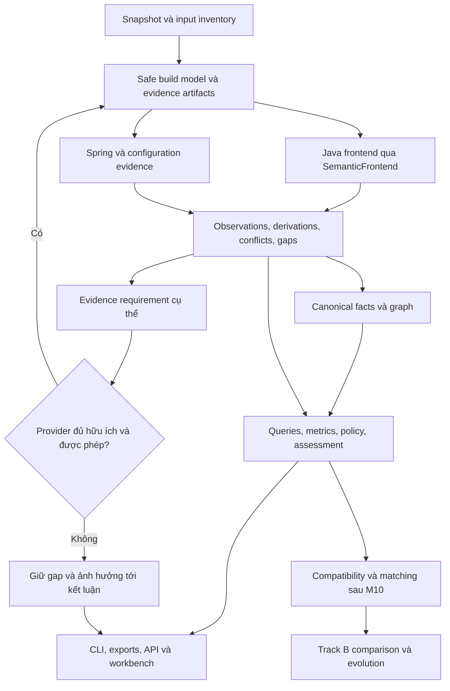

# Đề xuất củng cố nền tảng Architecture Intelligence — bản gửi Gemini audit

Ngày nghiên cứu: **2026-09-06**. Repository được đối chiếu tại commit **`cc5395e5b525f9d41c505729568eb05a7801a8dd`**.

**Phạm vi:** đánh giá đề xuất Gemini, nghiên cứu nguồn gốc, đề xuất thiết kế và cách kiểm chứng. Chỉ tạo tài liệu này; không sửa code, cấu hình, ADR, roadmap, current state hay dữ liệu benchmark. Không chạy build của repository được phân tích, không triển khai tính năng, không commit/push và không gửi nội dung ra Gemini thay người dùng.

**Tư cách của tài liệu:** đây là một đề xuất để phản biện, không phải ADR đã được chấp nhận hay bằng chứng qua gate. Chủ dự án đã cho phép tác giả tự quyết định nội dung khuyến nghị; điều đó không biến các khả năng chưa đo thành sự thật và không tự kích hoạt milestone tiếp theo.

## 1. Kết luận và lựa chọn đề xuất

**Nên áp dụng bốn hướng năng lực, nhưng không áp dụng nguyên văn bản Gemini.** Kiến trúc tiến hóa, thu nhận thêm bằng chứng, policy/metrics và visual workbench đều phù hợp. Phần lớn đã được dự án chấp thuận về hướng đi. Giá trị của bản nâng cấp phải nằm ở cách hiện thực hóa, giới hạn chính xác và bằng chứng nghiệm thu, không phải thêm tên công nghệ hoặc cam kết “100%”.

Định vị tôi khuyến nghị:

> Nền tảng phân tích kiến trúc Java/Spring có khả năng giải thích mỗi kết luận bằng dữ liệu nguồn, cấu hình và provenance; chỉ ra chính xác phần chưa biết; thu nhận thêm bằng chứng khi có ích và được phép; theo dõi thay đổi kiến trúc giữa các snapshot có thể so sánh.

“Bao quát” nên được hiểu là **bao quát có hệ thống các lớp trường hợp đã đăng ký, phát hiện phần chưa được phân loại trong phạm vi quan sát, và mở rộng catalog khi gặp cơ chế mới**. Không có thiết kế hữu hạn nào bảo đảm hiểu đầy đủ mọi repository Java, mọi plugin build và mọi hành vi runtime. Không nên đổi lời hứa “100% resolve” thành lời hứa cũng không chứng minh được là “100% phát hiện mọi cơ chế động”.

Các quyết định biên tập của bản đề xuất:

| Hạng mục | Khuyến nghị | Lý do chính |
|---|---|---|
| Safe build model, exact classpath, platform/encoding, evidence gaps | Ưu tiên ngay trong M3 | Đây là phần còn thiếu thực tế ảnh hưởng toàn bộ downstream |
| Generated-source discovery có provenance | Giữ trong M3 | Có giá trị mà không phải tự chạy generator |
| Delombok do platform thực thi | Thử nghiệm có điều kiện; chưa mặc định | Phải chứng minh lợi ích, cách ly thực thi và không làm sai tọa độ nguồn |
| ASM provider riêng | Chỉ triển khai khi gap đã đo yêu cầu | Dự án đã có khả năng đọc dependency JAR qua `JarTypeSolver` |
| Spring intelligence | Giữ, làm theo ngữ nghĩa từng phiên bản và cấu hình | Candidate, selection, activation, proxy và runtime là các khái niệm khác nhau |
| Policy DSL, SCC, metrics | Giữ; định nghĩa semantics trước định dạng | Không lấy số lượng chu trình hoặc một công thức làm phán quyết chất lượng tổng quát |
| Workbench, SARIF, bounded impact | Giữ trong M7/M8 | Đây đã là sản phẩm Track A; cần nhất quán với evidence/query services |
| Compatible snapshot evolution | Giữ trong M11 sau M10 | Phải giải quyết compatibility, matching và evidence loss |
| Auto-refactor, xác minh patch, CI/PR gate như một sản phẩm | Hoãn theo phase hiện hành | Không cần các năng lực này để SE121 mạnh và đầy đủ |
| Cam kết industrial-grade, Q1/Q2, ICSE/FSE | Loại khỏi lời hứa | Chưa có bằng chứng vận hành hoặc nghiên cứu đủ để kết luận |

Điểm nên đầu tư thêm mạnh nhất là **tính đúng đắn của kết luận khi dữ liệu không đầy đủ**: biết khi nào có thể khẳng định vi phạm, khi nào chỉ có khả năng vi phạm, khi nào không đủ dữ liệu, và khi nào sự thay đổi chỉ là thay đổi khả năng quan sát.

## 2. Cơ sở dự án đã đối chiếu

### 2.1. Hiện trạng và thẩm quyền

**CONFIRMED — kiểm tra repository trong phiên này:** working tree và index sạch trước khi tạo tài liệu; HEAD như trên. Đọc Git status, working/staged diffs và recent log. Commit cuối cập nhật ba tài liệu trạng thái/hợp đồng; tên commit không thay cho bằng chứng kỹ thuật.

**CONFIRMED — theo quyết định đã ghi trong dự án:** SE121 chọn Track A + B; JavaParser/SymbolSolver sau `SemanticFrontend`; Java 21/Maven; domain không phụ thuộc parser/storage; workbench hoàn chỉnh; health tách confidence; progressive evidence là hướng kiến trúc đã chấp nhận. [Project context](../project-context.md), [ADR-001](../decisions/ADR-001-parser-technology.md), [ADR-002](../decisions/ADR-002-product-outcome-and-explainable-assessment.md), [ADR-003](../decisions/ADR-003-progressive-evidence-acquisition.md).

**CONFIRMED — dữ liệu lịch sử được đọc, không phải test chạy lại hôm nay:** record M2 hiện có 98 tests, zero failures/errors/skips; 18 catalog rows được exercise trong modern fixture; 15 explicit invocations đối chiếu compiler ở fixture đó. Đây là chứng cứ hữu hạn, không phải tỷ lệ đúng trên mọi Java project. [Verification summary](../reproducibility/m2-modern-2026-09-03/verification-summary.json), [M2 evidence](../reproducibility/m2-modern-2026-09-03/README.md).

**CONFIRMED — hiện trạng do tài liệu canonical ghi:** M2 frontend delivery complete; công việc kế tiếp M3; G2 chưa qua. Current state còn ghi final independent review và denominator chưa hoàn tất. Không nên diễn giải “M2 complete” thành “mọi yêu cầu chấp nhận đã được reviewer độc lập xác nhận”. [Current state](../current-state.md), [Roadmap](../roadmap.md).

Tài liệu ghi nhận kết quả sanity-check cục bộ ban đầu trên một số repository thử nghiệm. Trong phạm vi tìm kiếm tài liệu/evidence tracked chính thức, các số liệu thử nghiệm ad-hoc không có raw run bundle độc lập không được dùng làm proof of accuracy hay tự hủy trạng thái M2 đã được chủ dự án ghi nhận.

**CONFIRMED — đọc source và test:** [ResolutionEnvironment.java](../../analyzer-javaparser/src/main/java/com/evolution/analysis/javaparser/ResolutionEnvironment.java) đã xác minh digest, tạo `JarTypeSolver` từ bytes và thêm theo thứ tự input. [ResolutionInputsTest.java](../../analyzer-javaparser/src/test/java/com/evolution/analysis/javaparser/ResolutionInputsTest.java) chứa các case dependency removal, thứ tự JAR, origin và ngăn host application classpath rò vào analysis. Đọc test không tương đương chạy lại test.

**PROVISIONAL theo dự án:** schema M3+/M4, YAML, Cytoscape.js, Neo4j, backend framework, công thức score, budget UI. Các provider bytecode/execution/runtime chưa mặc nhiên được chọn để triển khai trong SE121.

### 2.2. Điều Gemini cần hiểu trước khi audit

Route dùng trong nghiên cứu này: `lead-architect` phối hợp trách nhiệm của `researcher`, `semantic-analyst`, `graph-architect`; workflow `execute → research/architect → verify → handoff`. Đây là các vai trò do một tác giả áp dụng, **không phải một cuộc independent multi-agent review**.

Đã dùng `se-project-engineering`, reference `semantic-evaluation` và `verification-before-completion`. Không áp dụng TDD vì không thay production behavior; không chạy full Maven để tạo cảm giác đã kiểm chứng một đề xuất prose.

Các nguồn hợp đồng cần đọc theo thứ tự, không chỉ đọc file này:

1. [AGENTS.md](../../AGENTS.md), [project-context](../project-context.md), [current-state](../current-state.md), [roadmap](../roadmap.md), Git status/diffs/log.
2. [Core rule](../../.agents/rules/00-agent-core.md), [engineering](../../.agents/rules/10-engineering-excellence.md), [evidence](../../.agents/rules/20-evidence-first.md), [research/architecture](../../.agents/rules/30-research-and-architecture.md), [Git/safety](../../.agents/rules/40-git-and-change-safety.md).
3. [Engineering skill](../../.agents/skills/se-project-engineering/SKILL.md), [semantic evaluation](../../.agents/skills/se-project-engineering/semantic-evaluation.md), [verification skill](../../.agents/skills/verification-before-completion/SKILL.md).
4. [Lead architect](../../.agents/agents/lead-architect.md), [researcher](../../.agents/agents/researcher.md), [semantic analyst](../../.agents/agents/semantic-analyst.md), [graph architect](../../.agents/agents/graph-architect.md); khi audit dùng thêm [red-team reviewer](../../.agents/agents/red-team-reviewer.md) và [review workflow](../../.agents/workflows/review.md).
5. [Research](../../.agents/workflows/research.md), [architect](../../.agents/workflows/architect.md), [verify](../../.agents/workflows/verify.md), [handoff](../../.agents/workflows/handoff.md).
6. [Architecture](../architecture/architecture.md), [M1](../architecture/m1-contracts.md), [M2](../architecture/m2-semantic-frontend.md), [evidence acquisition](../architecture/evidence-acquisition.md), [M4 Spring](../architecture/m4-spring-intelligence.md), [knowledge graph](../architecture/knowledge-graph.md), [product outcome](../architecture/product-outcome.md), ba ADR nêu trên và [research questions](research-questions.md).
7. Source/test và raw evidence liên quan đến từng phản biện; không dùng package comparator cũ làm oracle khi provenance/origin của nó có lỗi đã ghi nhận.

Một vài điểm tài liệu nội bộ cần audit sau, **không sửa trong tác vụ này**:

- M2 completion wording so với remaining independent review/denominator cần diễn giải nhất quán.
- Các bảng `Identity: qualifiedName` cũ trong knowledge graph là hypothesis; M1 mới là thẩm quyền identity đã triển khai.
- Product exit criteria đặt bước Track B trong danh sách Track A có thể gây hiểu vòng gate; M10 phải chấp nhận Track A trước khi thực thi M11.
- Ví dụ “singleton → prototype” không tự động là lỗi Spring; phải gắn yêu cầu lifecycle hoặc policy cụ thể. Spring cho phép injection đó, nhưng không tự cấp prototype mới cho mỗi lần dùng. [Spring Bean Scopes](https://docs.spring.io/spring-framework/reference/core/beans/factory-scopes.html).

## 3. Audit từng luận điểm của Gemini

Bản gốc được nhận dưới dạng `pasted-text.txt`, SHA-256 **`bd54e217158ec94ccfafe685b8e04da03567b93f4789f72ea783636ce6723198`**. Bản gốc gọi bốn nhóm là năng lực 1, 2, 3 và 5; cách đánh số này không chứng minh tồn tại một năng lực thứ năm bị thiếu.

| ID | Luận điểm gốc được tóm tắt | Đánh giá | Sửa thành |
|---|---|---|---|
| G01 | Hoàn thiện bốn năng lực trong sáu tháng sẽ đạt industrial-grade và đủ Q1/Q2/ICSE/FSE | Không được chứng minh | Sản phẩm có thể mạnh; mức trưởng thành và đóng góp nghiên cứu phải có evaluation riêng |
| G02 | Semantic/graph diff có giá trị hơn chỉ xem text diff | Giữ có giới hạn | Theo dõi delta kiến trúc có provenance; text diff vẫn hữu ích làm ngữ cảnh |
| G03 | Chỉ ra commit và PR đầu tiên gây một vòng phụ thuộc | Thiết kế lại | Earliest observed trên lịch sử đã phân tích; PR cần metadata; không suy ra trách nhiệm nhân quả |
| G04 | Bốn lifecycle INTRODUCED/PERSISTED/RESOLVED/REINTRODUCED | Giữ nhưng chưa đủ | Bổ sung evaluation/comparability state và bằng chứng vắng mặt; reintroduced cần history |
| G05 | Fine-grained diff tới statement/span cực hiếm trong nghiên cứu | Khẳng định quá mạnh | Đã có AST differencing và block history; cần phân biệt đóng góp architecture/evidence của dự án |
| G06 | 95% Spring project dùng các generator được liệt kê | Bỏ số | Chưa có survey/dataset xác định population, ngày và phương pháp hỗ trợ |
| G07 | Source AST làm công cụ chết khi gặp enterprise repo | Sai nếu nói tuyệt đối | Kết quả tùy symbol model, classpath, generated input và support boundary |
| G08 | Thiếu implementation body của JpaRepository làm mất call/dependency | Sai về mô hình call tĩnh | Resolve tới declaration kế thừa khác với biết runtime implementation và database effects |
| G09 | Không incoming CALLS nên kết luận EventListener là dead code | Là suy luận sai cần ngăn | Thiếu CALLS không chứng minh không có framework/external entry point |
| G10 | Thiếu cạnh có thể làm health score đẹp giả | Giữ | Định nghĩa qualification/withholding theo output; kiểm thử evidence removal |
| G11 | Source + ASM + Spring giúp near-100% precision/recall | Bỏ lời bảo đảm | Các provider có failure modes và dữ liệu tương quan; đo từng category/cấu hình |
| G12 | Delombok tự động trước parser giải quyết Lombok triệt để | Chỉ chọn có điều kiện | Giữ original source, generated artifact, mapping, version/config và execution boundary |
| G13 | Quét target/generated-sources là xóa 100% blind spots | Sai | Có stale/missing/custom-root/conflicting outputs; discovery không phải generation |
| G14 | ASM BytecodeSymbolSolver cần để đọc thư viện ngoài | Không đúng với repo hiện tại | `JarTypeSolver` đã làm binary symbol lookup; ASM cần incremental value riêng |
| G15 | Exact classpath là danh sách absolute JAR paths | Chưa đủ | Ordered logical artifact/content identities + module/source-set/platform; path chỉ là handle |
| G16 | ASM cho type resolution 100% mọi thư viện | Sai | Missing artifact, visibility, version, generics, dispatch và reflective target vẫn là vấn đề |
| G17 | Type matching + Primary/Qualifier/Profile mô phỏng Spring chính xác tuyệt đối | Sai | Cần context, version, conditions, name/generic matching, registration và explicit unknown |
| G18 | Reflection là điểm mù vĩnh viễn | Quá tuyệt đối | Một số case suy ra từ constant/config; runtime evidence chỉ chứng thực execution đã quan sát |
| G19 | Cần node DYNAMIC_INVOCATION và status DYNAMIC_UNRESOLVED | Ý tưởng chưa phải schema hợp lệ | Dùng observation/mechanism/gap và M1 status hiện hữu; node/enum mới phải có contract |
| G20 | Tarjan + Johnson liệt kê mọi cycle hàng chục nghìn đỉnh trong vài giây | Không thể cam kết từ kích thước đỉnh | SCC tuyến tính; enumeration phụ thuộc số chu trình, cần bounds |
| G21 | Martin metrics đo trực tiếp vùng kiến trúc tốt/xấu | Giữ công thức, giảm diễn giải | Định nghĩa scope, inclusion, zero denominators; diagnostic lens, không phải chân lý chất lượng |
| G22 | YAML DSL tự động chặn commit gây architectural decay | Tách hai việc | Policy/report thuộc SE121; external gate/PR enforcement chưa là delivery commitment |
| G23 | Cytoscape/WebGL bảo đảm workbench 60fps | Chưa có căn cứ | Pin renderer, benchmark payload/layout/style/hardware và hoàn thành user journey |
| G24 | Xóa method trên UI sẽ biết mọi class chắc chắn gãy | Sai | Potential structural impact, có path, bounds và điều kiện; không phải compile/runtime verification |
| G25 | SARIF cắm GitHub là tự có PR cảnh báo đầy đủ | Có điều kiện | Chuẩn export, subset GitHub, quyền repo, fingerprints, locations và workflow là các gate khác nhau |

### 3.1. Sửa hai ví dụ dễ làm sai kiến trúc

`repo.findById(id)` có thể được gán tới declaration thừa kế dù declaration không có body. JLS phân biệt declaration chọn lúc biên dịch với quá trình thực hiện lời gọi. [JLS 21 §15.12](https://docs.oracle.com/javase/specs/jls/se21/html/jls-15.html#jls-15.12). Spring Data có repository proxy và các reserved methods như `CrudRepository.findById`. [Spring Data query methods](https://docs.spring.io/spring-data/jpa/reference/repositories/query-methods-details.html).

**Hệ quả thiết kế đề xuất:** giữ cạnh tới declaration thật; thêm vai trò Spring Data repository/entity khi có evidence. Không tự tạo cạnh chắc chắn tới database/table, transaction hay SQL cụ thể. Một luật “Controller không được phụ thuộc Repository” không cần biết SQL để đánh giá, nhưng chính luật đó phải được cấu hình, không được coi là đúng cho mọi kiến trúc.

`@EventListener` khai báo callback trên managed bean; thiếu lời gọi trực tiếp từ application source không phủ nhận đường kích hoạt framework. Điều kiện listener còn có thể phụ thuộc SpEL. [Spring ApplicationContext events](https://docs.spring.io/spring-framework/reference/core/beans/context-introduction.html#context-functionality-events-annotation).

**Hệ quả thiết kế đề xuất:** phân biệt Java call, framework entry point, event publication, listener candidate và runtime delivery. Không cần triển khai dead-code analysis hoặc auto-refactoring để sửa lỗi suy luận này: chỉ cần API không tuyên bố “unused” từ degree bằng không.

### 3.2. Phản ví dụ hiệu năng đủ để bác bỏ lời hứa

Johnson 1975 nêu thời gian `O((V + E)(C + 1))`, với `C` là số elementary circuits. [Bài báo gốc, bản PDF](https://www.jonglage.net/theorie/notation/siteswap-avancee/data/Johnson-Finding%20All%20The%20Elementary%20Circuits%20Of%20A%20Directed%20Graph,%201975.pdf), [DOI](https://doi.org/10.1137/0204007).

**CONFIRMED — phép tính tổ hợp trong phiên này:** đồ thị có hướng đầy đủ, không self-loop, 12 đỉnh có **119.481.284** simple directed cycles, tính một chu trình một lần theo phép quay và giữ hai hướng là khác nhau:

`C(n) = Σ[k=2..n] n! / (k × (n-k)!)`.

Đây không phải benchmark chạy Johnson. Nó là phản ví dụ cho việc hứa liệt kê toàn bộ chu trình chỉ dựa trên số đỉnh. Vì vậy mặc định nên tính SCC và lấy witness có giới hạn; tách `cyclicSccCount`, số witness trả về và exact cycle count nếu thực sự tính xong.

## 4. Kiến trúc đề xuất sau hiệu chỉnh

Các cấu trúc mới trong các phần tiếp theo là **CANDIDATE IDEA** để Gemini phản biện. Chúng bổ sung chi tiết cho hướng đã được chấp thuận, không thay identity M1 hoặc tạo production API trong phiên này.

Provider không nằm trong một trật tự “source yếu, bytecode mạnh, runtime mạnh nhất” cho mọi câu hỏi. Source có thể tốt hơn cho declaration span hoặc annotation không lưu trong class file; bytecode giúp biết thành viên thật của artifact; runtime giúp biết một activation thực tế. Chúng có thể bổ sung hoặc mâu thuẫn nhau.

### 4.1. M3: thu nhận đúng đầu vào trước khi tăng số engine

**Đề xuất thực thi đầu tiên:** một vertical slice effective-model/classpath thật cho Maven single-module và multi-module, nối trực tiếp M2; gaps đi cùng sản phẩm của slice. Không xây một orchestration framework lớn trước khi có consumer.

Maven effective model có inheritance, profile activation, interpolation và dependency-management import; dependency selection có mediation, scopes, exclusions và optional dependencies. Một bộ quét `<dependency>` đơn thuần không tái hiện mô hình đó. [Maven Model Builder 3.9.16](https://maven.apache.org/ref/3.9.16/maven-model-builder/), [Dependency mechanism](https://maven.apache.org/guides/introduction/introduction-to-dependency-mechanism.html).

Thiết kế M3 đề xuất:

- Tách discovery, model interpretation và artifact resolution; không launch Maven trên target để lấy “effective POM” bằng mọi giá. Xem xét thư viện Maven Model Builder/Resolver được pin, nhưng kiểm tra boundary của API, custom extensions, system properties, filesystem và network trước khi chọn.
- Mỗi module/source set có source roots, generated roots, language level, platform view và ordered classpath riêng. Reactor aggregator không mặc nhiên là Java module có source.
- Parent/BOM, dependency management và actual dependencies là các vai trò khác nhau. Missing parent/profile input không được âm thầm thay bằng host environment.
- Artifact identity dùng logical coordinate và content digest; path tuyệt đối là locator của máy. Ghi rõ precedence, duplicate classes, module output/JAR binding và source-set visibility.
- Tách Maven profiles khỏi Spring profiles; cả hai có thể ảnh hưởng analysis nhưng không phải cùng một tập điều kiện.
- Source encoding dựa trên bằng chứng hoặc declared assumption; original bytes/hash giữ nguyên. Byte-order mark khác với Maven bill of materials dù cùng viết tắt BOM.
- Analyzed Java platform độc lập analyzer runtime. `--release`/source/target, JDK view, multi-release JAR, module path/JPMS và preview phải có handling đã đăng ký. JAR specification có selection theo release cho multi-release entries. [JAR specification, Java 21](https://docs.oracle.com/en/java/javase/21/docs/specs/jar/jar.html#multi-release-jar-files).
- Giới hạn số file/archive entries, dung lượng, thời gian, network và đường dẫn theo policy. Không tự nạp build extension hay processor từ repository; parse XML không giải external entity ngoài phạm vi. Đây là yêu cầu kỹ thuật cho input untrusted, không phải lý do dừng việc đọc metadata.

**Exit criterion đề xuất:** từ fixture/repository pin, tái tạo được module/source/platform/classpath model, không dependency superset, không hidden host input; khi thiếu input, vẫn có inventory và gap có reason. Với Gradle/custom build, tiếp tục explicit input manifest theo roadmap đến khi có provider an toàn được xác nhận.

### 4.2. Generated sources: discovery, acceptance và generation là ba bước

Delombok chuyển source Lombok thành Java source mở rộng và có thể thay cách trình bày/comment. MapStruct là annotation processor sinh implementation; việc kết hợp Lombok có yêu cầu integration riêng. [Delombok](https://projectlombok.org/features/delombok), [MapStruct 1.6.3](https://mapstruct.org/documentation/stable/reference/html/#lombok).

Không nên chạy delombok rồi coi file mới là source gốc. Đề xuất lưu:

| Thành phần | Hợp đồng đề xuất |
|---|---|
| Original source | Bytes, charset, digest và source span thật như M1/M2 |
| Generated/transformed document | Artifact/document riêng, hash riêng, source-set riêng và tên provider |
| Derivation | Input digests, generator version/config, classpath/platform, command/policy nếu có thực thi |
| Source mapping | Ánh xạ đã kiểm chứng hoặc trạng thái không có mapping; tuyệt đối không copy line/column giữa hai file |
| Generated declaration | Identity theo source/binary semantics đã đăng ký; generated provenance; không gán declaration span của annotation thành body được sinh |
| Freshness | Có liên kết đủ tới inputs hiện tại, hoặc chưa xác minh, stale, conflict; timestamp chỉ là dấu hiệu phụ |
| Accepted-input policy | Chấp nhận artifact supplied theo declared assumption được ghi nhận khác với chứng minh artifact do snapshot hiện tại sinh ra |

`target/generated-sources/annotations` và các đường dẫn OpenAPI thông dụng chỉ là discovery hints. Thư mục có thể cũ, không tồn tại ở clean checkout, được tùy biến hoặc thuộc test/module khác. Không có output không đồng nghĩa không có generator. Có output không đồng nghĩa output khớp snapshot.

**Điểm phải xử lý ở contract:** M1 yêu cầu `SourceDocument` khớp file/digest trong snapshot inventory. Output vừa sinh trong scratch directory không tự thuộc original snapshot. Cần versioned acquired-artifact/input-plan representation hoặc analysis snapshot dẫn xuất có lineage được định nghĩa rõ; không nhét file mới vào manifest cũ, đổi hash snapshot gốc hoặc tự cấp original-document identity cho generated output. Việc chọn cách biểu diễn là M3/provider contract decision, chưa được thực hiện trong tài liệu này.

Thứ tự khuyến nghị:

1. Phát hiện generator/root declaration và available artifacts một cách thụ động.
2. Thu nhận output được cung cấp có provenance; nếu chưa biết lineage/freshness, giữ qualification thích hợp.
3. Đo phần câu hỏi còn chưa trả lời sau bước 2 và exact classpath.
4. Chỉ cân nhắc delombok/generator execution provider nếu lợi ích đủ rõ; phải pin executable, xử lý cấu hình/đường dẫn, resource/side effects và approval theo execution boundary hiện hành.

Không coi việc thực thi trong memory hoặc scratch directory là sandbox. Delombok cũng không thay cho MapStruct, QueryDSL, OpenAPI hoặc mọi annotation processor khác. Không tự động chạy `mvn compile`, `generate-sources` hay processor tùy ý trên target.

**Các case bắt buộc nếu thử nghiệm:** Lombok constructor injection, getter/builder với cấu hình khác nhau, MapStruct phối hợp Lombok, missing generator output, stale output, duplicate original/generated declaration, custom output root, generated test sources, CRLF/Unicode và không có original-source mapping.

### 4.3. ASM: có giá trị, nhưng không nên viết lại điều đã có

Upstream `JarTypeSolver` 3.27.1 đã đọc class trong JAR và dùng Javassist; implementation của repository hiện tại đã sử dụng nó. [JavaParser source đã pin](https://github.com/javaparser/javaparser/blob/javaparser-parent-3.27.1/javaparser-symbol-solver-core/src/main/java/com/github/javaparser/symbolsolver/resolution/typesolvers/JarTypeSolver.java). ASM là thư viện đọc/phân tích/chuyển đổi bytecode, không phải lời bảo đảm tự có full Java type system. [ASM](https://asm.ow2.io/).

Tách ba nhu cầu trước khi chọn công nghệ:

| Nhu cầu | Baseline | Khi nào ASM provider có lý do |
|---|---|---|
| Đọc class/method signatures của dependency | M2 `JarTypeSolver` + M3 exact inputs | Fixture chứng minh missing metadata/behavior cần thiết mà adapter hiện tại không cung cấp được hợp lý |
| Đọc annotation/framework metadata không có source | API metadata hiện có hoặc reader chọn lọc | Cần scan bounded artifact metadata độc lập, không load target classes |
| Trích dependency từ body đã compile hoặc generated project output | Chưa có full provider riêng | Gaps có tác động policy/graph được lượng hóa và source-binary reconciliation đã thiết kế |

**Khuyến nghị:** nếu cần, bắt đầu bằng `BytecodeMetadataProvider` nhỏ sau evidence-provider boundary; không thêm một `BytecodeSymbolSolver` toàn năng tự động được hỏi khi bất kỳ lỗi JavaParser nào xảy ra. Với adapter defect, thêm provider fallback có thể chỉ che giấu bug.

Class-file debug metadata có thể thiếu; `LineNumberTable` chỉ ánh xạ instruction với line, không đảm bảo full source span. [JVMS 21 §4.7.12](https://docs.oracle.com/javase/specs/jvms/se21/html/jvms-4.html#jvms-4.7.12).

**Hệ quả thiết kế riêng của đề xuất:** binary evidence dùng artifact hash, class/member descriptor và instruction/attribute anchor nếu có; không ép vào `RelationshipOccurrence` đòi source span. Khi join với source, cần quy tắc cho bridge/synthetic members, constructor parameters do compiler thêm, local/anonymous names, generic erasure, annotations, instrumentation và version mismatch. Không cộng hai observations cùng một fact thành hai dependencies. Nếu chưa join được, giữ observation/gap/conflict.

**Điều kiện nhận ASM vào SE121:** có fixture gap cần cho gate, baseline hiện tại thất bại có reason, provider mới cải thiện correct facts hoặc evidence cần thiết, không tăng false certainty, và chi phí giữ được Track A/B. Nếu chỉ tăng số resolved không có nhãn kiểm chứng, chưa đủ.

### 4.4. Spring: mô hình có cấu hình, không tái tạo toàn bộ container

Giữ các concept đã được đề xuất trong M4: `BeanProducer`, `BeanDefinitionCandidate`, `InjectionPoint`, `ConfigurationCondition`, `BindingCandidate`. Không rút gọn thành class có annotation rồi nối `INJECTS` chắc chắn.

Qualifier thu hẹp tập type candidates, không chỉ là lookup một bean name. Name fallback và parameter metadata có semantics phụ thuộc phiên bản; `@Fallback` có từ Spring 6.2. [Spring qualifiers](https://docs.spring.io/spring-framework/reference/core/beans/annotation-config/autowired-qualifiers.html), [Primary/Fallback](https://docs.spring.io/spring-framework/reference/core/beans/annotation-config/autowired-primary.html).

**Thiết kế đề xuất:** ruleset phải pin Spring Framework/Boot version từ analyzed inputs, không dùng phiên bản thư viện của chính analyzer. Candidate filtering, preference, collection semantics, activation và resolution result là những bước riêng; không viết một bảng ưu tiên phổ quát “Qualifier > Primary > Profile”.

Mỗi binding có thể giải thích:

- Bean nào được phát hiện từ producer nào; component/repository scan có thực sự bao phủ producer không.
- Type/generic shape, qualifiers, bean names/aliases và injection-site metadata nào được dùng.
- Candidate nào bị loại, vì lý do gì; loại do điều kiện false khác với thiếu dữ liệu để đánh giá điều kiện.
- Điều kiện nào đã được đánh giá bằng configuration inputs cụ thể; điều kiện nào chưa biết.
- Một selected binding được bảo đảm trong ngữ cảnh phân tích nào; có gaps về candidate universe có thể thay đổi lựa chọn không.

Auto-configuration dùng metadata và nhiều điều kiện về classpath, properties, beans; đọc `@Bean` đơn lẻ chưa đủ xác định activation. [Spring Boot auto-configuration development](https://docs.spring.io/spring-boot/reference/features/developing-auto-configuration.html).

#### Điều kiện trên đường đi và chu trình

**CANDIDATE IDEA — nên ưu tiên cao:** ngoài evidence trên từng cạnh, giữ điều kiện chung của cả path/witness.

Ví dụ tự xây dựng: cạnh `A → B` chỉ có khi `@Profile("prod")`; cạnh `B → A` chỉ có khi `@Profile("!prod")`. Hợp đồ thị tạo vòng A–B nhưng không có cấu hình nào thỏa `prod ∧ !prod`. Không được báo đó là một binding cycle chắc chắn.

Không dùng ví dụ `prod` và `dev` như hai profile tự nhiên loại trừ nhau: Spring cho phép đồng thời nhiều active profiles. Chỉ loại trừ khi predicate/configuration contract chứng minh điều đó.

MVP đề xuất đánh giá trên các configuration set hữu hạn được cung cấp; conjunction ngoài ngữ nghĩa hỗ trợ giữ `CONDITIONAL`/unknown. Chưa cần giải một SAT/SMT engine tổng quát. Union view trên UI vẫn hữu ích nếu được ghi rõ là tổng hợp nhiều khả năng, không phải một runtime configuration.

#### Taxonomy cần mở rộng có kiểm soát

M4 hiện có 20 mechanism rows. Đây chủ yếu là wiring taxonomy; nó chưa phải toàn bộ Spring behavior taxonomy. Cần audit các row con hoặc catalog liên quan cho:

| Cụm | Phạm vi đề xuất trong SE121 | Không tự khẳng định |
|---|---|---|
| REST mapping và framework entry points | Endpoint/callback declarations, composed annotations, source/config anchors | Một URL chắc chắn reachable trong deployment |
| Spring Data repositories | Repository interface/entity, inherited declarations, producer/candidate evidence | SQL/table/runtime effects đầy đủ |
| Events | Publisher call evidence, listener declaration, event-type candidates, conditions | Publish nào chắc chắn dẫn đến listener nào lúc chạy |
| Scheduled/async/lifecycle callbacks | Detect và phân loại entry points; binding khi semantics đã kiểm chứng | Luồng chạy/timing đầy đủ |
| AOP/transaction/cache/security annotations | Detect mechanism; projection/rule rất hẹp khi đủ điều kiện | Annotation đồng nghĩa advice chắc chắn chạy |
| XML, registrars, FactoryBean, getBean, SpEL | Theo handling matrix hiện hữu; giữ missing evidence | Mọi registration được giải tĩnh hoàn toàn |

Proxy-based Spring AOP có self-invocation bypass; AspectJ weaving là trường hợp khác. [Spring proxy semantics](https://docs.spring.io/spring-framework/reference/core/aop/proxying.html). Vì vậy một rule transaction/self-invocation chỉ đáng đưa vào sau core M4, phải có điều kiện proxy mode và negative controls. Đây là ví dụ extension có giá trị, chưa là công việc bắt buộc mới.

**Exit criterion đề xuất cho G3:** mỗi registered mechanism có expected handling, detection labels, candidate labels khi áp dụng, selected-binding labels, provenance và negative controls. `SUPPORTED` không đồng nghĩa `RESOLVED`; `DYNAMIC` không đồng nghĩa bị bỏ qua. Dùng controlled test-owned Spring fixtures làm oracle ở task được phép, không khởi động tùy ý target application.

### 4.5. Policy engine: kết luận có điều kiện chứng minh

YAML phù hợp để con người cấu hình, nhưng không phải phần khó nhất. Phần khó là mỗi rule định nghĩa chính xác loại dependency, scope, conditions và khi nào evidence đủ để kết luận. Rule ban đầu nên giữ forbidden dependency, configured boundaries và cycles.

**CANDIDATE IDEA — typed policy evaluation result**, tách khỏi enum trạng thái semantic M1:

| Kết quả logic đề xuất | Điều kiện |
|---|---|
| `VIOLATED` | Có witness hợp lệ theo semantics của rule và cùng context |
| `SATISFIED` | Rule áp dụng; phạm vi cần kiểm tra được bao phủ đủ và không có counterexample |
| `INDETERMINATE` | Missing/conflicting/conditional evidence có thể đổi kết luận |
| `NOT_APPLICABLE` | Rule thực sự không áp dụng; lý do rõ ràng |

Run failure, cancellation, excluded scope và rule cấu hình lỗi nằm ở evaluation/operational metadata; không biến thành `SATISFIED`. Tên enum cuối cùng cần được quyết định ở contract task, không sao chép bảng này vào code ngay.

Một positive witness của forbidden dependency vẫn có thể đủ dù module khác bị thiếu dữ liệu. Ngược lại, “không có dependency vi phạm” cần coverage đủ trên phạm vi bị cấm. Không nên có một công tắc “repo partial → mọi finding đều uncertain”; cũng không nên “mọi finding không thấy → pass”.

Mỗi rule cần ít nhất: stable ID/version, selectors, dependency categories, scope/source-set, projection/aggregation, allowed conditions, uncertainty policy, severity/rationale và witness requirements. Selector không match gì phải lộ ra vacuous evaluation để người dùng không nhận một kết quả xanh vô nghĩa.

Waiver/suppression là trạng thái quản trị finding, không xóa sự tồn tại cấu trúc. Nếu thêm, cần reason, scope, rule version, provenance và expiry khi dùng; không tự áp dụng waiver. Không chấm sức khỏe cao hơn vì một finding chỉ được ẩn trên UI.

### 4.6. Cycle engine và metrics có semantics rõ

**Cycle engine đề xuất:**

1. Tạo projection đã pin module/package/type và dependency categories; deduplicate structural edges nhưng giữ occurrence evidence.
2. Tính SCC bằng thuật toán tuyến tính trên projection đó; SCC một đỉnh chỉ cyclic khi có self-loop phù hợp định nghĩa.
3. Trả witness paths/cycles theo deterministic order và count/depth/size bounds.
4. Dùng Johnson chỉ cho yêu cầu enumeration có giới hạn; báo `truncated`/`PARTIAL` khi chưa liệt kê hết.
5. Tách graph size, cyclic SCC count, cyclic members, witness count và exact elementary cycle count. Không dùng count witness bị cắt làm số chu trình toàn repo.

Không cần chuyển Tarjan thành “đột phá học thuật”. Điều đáng kiểm chứng là graph projection đúng, witness đúng, bounded behavior và không mất uncertainty. ArchUnit cũng có giới hạn cycle detection/reporting. [ArchUnit cycle configuration](https://www.archunit.org/userguide/html/000_Index.html#_configurations).

**Martin metrics:** giữ `I = Ce/(Ca+Ce)`, xem xét thêm `A = Na/N` và `D = |A+I-1|` như diagnostic views, không làm công thức health tổng quát. Các implementation có inclusion rules khác nhau; ArchUnit chẳng hạn tính A từ public classes. [ArchUnit Martin metrics](https://www.archunit.org/userguide/html/000_Index.html#_component_dependency_metrics_by_robert_c_martin).

Đề xuất chọn **distinct neighboring components** làm một định nghĩa rõ cho Ca/Ce trên module/package projection; nếu cần type-based coupling thì tạo metric ID khác. Không gọi cả hai cùng một ID. Một nghìn invocation giữa hai module không tự biến thành một nghìn architectural dependencies.

Metric contract phải trả lời:

| Vấn đề | Quy tắc đề xuất để audit |
|---|---|
| Population | Main/test/generated/external/nested/local/anonymous được tính thế nào |
| Relation meaning | Compile-time type/call, selected Spring binding hay candidate union; không trộn vô danh |
| Ca/Ce | Đếm neighbor, type pair hay occurrence; scope resolution và dedup nào |
| A | Abstract classes/interfaces, public-only hay all, annotation/enum/record nào thuộc denominator |
| Zero denominator | `I` khi Ca+Ce=0 và A khi population rỗng không có số giả; tuân thủ `NOT_APPLICABLE` M1 |
| D | Chỉ tính khi A và I hợp lệ cùng scope; nêu normalized distance, không suy ra defect chắc chắn |
| Evidence gaps | Count quan sát được có thể là lower bound trong một số định nghĩa; ratio không mặc nhiên là lower bound |
| Comparability | Metric version, projection, policy, population và evidence conditions phải được kiểm tra |

Ví dụ tự xây dựng: xóa dependency input có thể làm Ce giảm, làm cả I và D tăng hoặc giảm tùy Ca/A. Vì vậy không được yêu cầu “mọi metric phải đơn điệu khi thêm evidence”. Yêu cầu đúng hơn là **mất evidence không được tạo một cải thiện health được tuyên bố là đã xác minh**.

Score vẫn là required product theo ADR-002. Khi chưa đủ điều kiện, workbench hiện `WITHHELD` cùng metrics/evidence có ích; không loại bỏ score feature và cũng không bịa số. Không có policy không đồng nghĩa perfect conformance. Tránh phạt cùng một cấu trúc lặp lại qua SCC, cycle witnesses và nhiều rule mà không có quy tắc aggregation.

### 4.7. Track B: evolution phân biệt thay đổi hệ thống và thay đổi quan sát

Track B giữ sau M10/human approval; hôm nay chỉ chuẩn bị design. Entity/relationship identity trong một snapshot và entity correspondence xuyên snapshot là hai trách nhiệm khác nhau.

**Các tầng matching đề xuất:**

1. Exact identity cho symbol đủ ổn định theo M1/M2.
2. Mapping của declaration/structural relation khi evidence anchor dịch chuyển nhưng semantics không đổi.
3. Rename/move candidates có algorithm/version/evidence riêng; uncertain mapping không ép thành “cùng entity”.

Không đổi M1 source spans để làm lịch sử đẹp. Local/anonymous/lambda keys hiện chứa source offset; thêm một comment có thể đổi key. Cần correspondence riêng. External identity chứa artifact content: thay JAR cũng có thể đổi entity ID dù API declaration nhìn giống nhau. Matching cần nhận biết trường hợp đó, không chỉ set-diff hashes.

**Compatibility không phải yêu cầu hai AnalysisIdentity bằng nhau.** Hai snapshot khác nhau phải có analysis identities khác. Cũng không nên cấm mọi dependency change: sửa version dependency trong POM là thay đổi repository hợp lệ cần được thể hiện trong evolution.

| Biến thay đổi | Diễn giải đề xuất |
|---|---|
| Source/build/config thuộc repository thay đổi, analyzer và comparison policy giữ cố định | Có thể so sánh; trình bày delta input là một phần repository evolution |
| Analyzer/parser/provider, schema, rule hoặc formula đổi | Không tự quy delta cho repository; reanalyze baseline/target cùng stack hoặc dùng migration đã kiểm chứng |
| Source không đổi nhưng dependency download khác bytes, ambient env khác | Input/provenance drift; cần lý do, không gọi là source change |
| User chọn Spring configuration set khác | Có thể là configuration comparison, không tự gọi là code regression |
| Evidence acquisition đầy đủ hơn | Evidence delta; finding mới nhìn thấy không tự là violation mới được introduce |
| Missing module, canceled run, policy scope bị loại | Không suy ra resolved; comparison không đủ điều kiện ở affected scope |

#### Lifecycle có bằng chứng vắng mặt

**CANDIDATE IDEA:** giữ bốn lifecycle business states, nhưng đặt bên cạnh comparison/evaluation status. Không mở rộng chúng thành một enum ôm mọi điều.

| Quan sát trên lịch sử có thứ tự và đủ điều kiện | Kết luận hợp lệ |
|---|---|
| Baseline đủ coverage, không vi phạm; target có witness | `INTRODUCED` trong khoảng so sánh |
| Baseline và target có violation tương ứng | `PERSISTED`, dù witness/span chi tiết có thể đổi |
| Baseline có violation; target cùng scope được đánh giá đủ và không còn violation | `RESOLVED` trong phạm vi semantics đã định nghĩa |
| Đã có violation → có lần được chứng minh resolved → xuất hiện lại | `REINTRODUCED` trên lineage đã chọn |
| Baseline thiếu evidence; target nhìn thấy violation | Newly observed; chưa đủ kết luận introduced |
| Target mất JAR/source/rule coverage | Không đủ kết luận resolved |
| Waiver mới, rule disabled, filter đổi | Administrative/evaluation delta, không phải structural resolution |
| Entity thật sự bị xóa với inventory đủ | Có thể resolved với reason `subject removed`; không đồng nghĩa refactoring tốt |

Với SCC split/merge, report structural membership delta; không force một identity SCC cũ ứng với một SCC mới. Cycle witness đổi không nhất thiết là cycle problem cũ được sửa và problem mới xuất hiện. Rule version và fingerprint/correspondence policy phải cùng có trong comparison provenance.

Hai snapshot không đủ để kết luận reintroduced nếu không có historical state hỗ trợ. “Commit đầu tiên” cần xác định parent lineage, merge handling, shallow history, skipped commits và dependency availability. Chọn `first-parent` có thể là policy hợp lý cho MVP nhưng phải công khai. Không dùng binary search mặc định vì sự tồn tại vi phạm không đơn điệu theo lịch sử.

Tên hiển thị đề xuất: **“lần đầu quan sát thấy trong lịch sử đã phân tích”**. Chỉ khi kiểm tra khoảng lịch sử đầy đủ và predecessor phù hợp mới có thể thu hẹp event về một commit trong lineage. Liên kết PR cần dữ liệu forge đáng tin cậy; Git commit không tự chứa ánh xạ PR, và neither commit nor PR chứng minh ai chịu trách nhiệm nhân quả cho architectural decay.

### 4.8. Workbench và impact: sản phẩm phải trả lời được câu hỏi

Giữ workbench đầy đủ trong Track A. Hiệu ứng thuyết phục nhất là người dùng đi từ summary/violation tới exact source và biết kết luận còn phụ thuộc giả định nào.

Các câu hỏi giao diện nên trả lời trực tiếp:

- Repository này có những module và entry points nào trong phạm vi phân tích?
- Luật nào bị vi phạm; một witness cụ thể nằm ở đâu?
- Binding này chọn bean vì sao; candidate nào còn có thể thay đổi lựa chọn?
- Metric này tính từ những input nào; vì sao score có số hoặc bị withheld?
- Tôi cần thêm bằng chứng nào để trả lời câu hỏi đang thiếu?
- Những dependents nào có đường tác động tới symbol này và kết quả bị giới hạn ở đâu?

Graph view mặc định theo module/package/configured layer, mở dần tới type/member. Không hard-code mọi dự án thành Controller → Service → Repository; hỗ trợ modular/hexagonal/layered projections theo policy, có `unassigned`/overlapping assignments khi cần. Tách dependency direction với chiều truy vấn dependents.

Cytoscape.js là candidate hợp lý. Bài công bố renderer 3.31 là **preview**, nêu performance tùy graph/style/browser/hardware và có giới hạn. Không dùng nó để bảo đảm mọi phiên bản hiện tại hay mọi graph đạt 60fps. [Cytoscape WebGL preview, 2025-01-13](https://blog.js.cytoscape.org/2025/01/13/webgl-preview/).

**Khuyến nghị:** thử Canvas baseline và WebGL candidate trên cùng registered projection; layout như layered/Sugiyama-family là lựa chọn presentation, không chứng minh direction hợp kiến trúc. Condense SCC trước layout tầng; giữ raw canonical graph riêng. Đo query latency, payload bytes, layout time, time to first useful graph, interaction frame times và memory. Frame rate là một chỉ số trong user journey, không phải toàn bộ quality gate.

Mọi response bounded cần metadata về returned count, limit, completeness/truncation và continuation nếu có. UI phải phân biệt “0 results” với “chưa tính”, “bị cắt”, “unknown”. Keyboard/table/list alternatives, non-color cues và loading/partial/error/canceled states là phần sản phẩm, không phải trang trí cuối kỳ.

**Impact:** đổi nhãn “giả lập xóa và thấy tất cả phần gãy” thành “xem phạm vi phụ thuộc có thể chịu ảnh hưởng”. Nêu seed, direction, categories, max depth/nodes/paths, context và coverage. Java static call target không tự cho full runtime dispatch closure; model có thể cần override/implementation relationships sau gate tương ứng. Không có visible dependents không chứng minh an toàn để xóa.

Graph-edit preview có thể là ý tưởng tương lai, nhưng một edited graph không thay cho compiler, tests hoặc runtime. Chưa triển khai patch hay khẳng định behavior preservation trong SE121.

### 4.9. SARIF và CI: giữ ranh giới sản phẩm chính xác

SARIF 2.1.0 là export chuẩn phù hợp cho finding; canonical JSON vẫn cần giữ đầy đủ graph/evidence/metrics. `baselineState` của SARIF gồm các trạng thái chuẩn như new/unchanged/updated/absent, không có ánh xạ một-một với domain reintroduced. [OASIS SARIF 2.1.0](https://docs.oasis-open.org/sarif/sarif/v2.1.0/os/sarif-v2.1.0-os.html).

**Thiết kế exporter đề xuất:** stable rule identifiers, correct URI/region/column convention, fingerprints được kiểm chứng, related locations và supporting paths khi phù hợp; schema validation và golden cases. Evidence thiếu source location thì giữ dạng export được phép hoặc nêu hạn chế, không bịa location. Domain lifecycle giữ trong properties/canonical export theo schema riêng khi format chuẩn không đủ.

GitHub chỉ hỗ trợ một phần SARIF và có giới hạn upload; tài liệu tại ngày nghiên cứu nêu 10 MB gzip, điều kiện repo/Code Security và yêu cầu để theo dõi alerts ổn định. [GitHub SARIF support](https://docs.github.com/en/code-security/reference/code-scanning/sarif-files/sarif-support).

**Quyết định phạm vi đề xuất:** M7 làm export và local validation. Một GitHub import smoke test về sau là interoperability check trên repo được phép. Upload thành công không đồng nghĩa PR annotation đầy đủ, branch protection hoặc merge blocking đã cấu hình. Không thêm “tự động chặn commit” như commitment mới trong phiên này; không nhầm pipeline CI kiểm thử chính analyzer với một Verified PR/CI-CD product cho repository được phân tích.

## 5. Những bổ sung đáng đầu tư nhất

Không cần thêm nhiều engine để dự án mạnh hơn. Các ý tưởng dưới đây dùng lại evidence/domain/query boundary đã có trong thiết kế, và chỉ được triển khai khi tới milestone phù hợp.

| Ưu tiên | Ý tưởng | Phần mới so với tài liệu hiện có | Giá trị và giới hạn | Milestone |
|---|---|---|---|---|
| P0 | Qualification theo từng kết luận/query | Cụ thể hóa `affectedOutputs` và evidence requirements thành quyết định có thể kiểm thử | Giữ finding chắc chắn khi có witness; không cấp “pass” nếu thiếu dữ liệu cần thiết | M3 foundations → M5/M6 |
| P0 | Generated artifact lineage và source mapping | Cụ thể hóa acceptance/freshness/conflict cho generated output | Tránh stale output và tọa độ giả; không đòi xây build sandbox ngay | M3, provider sau |
| P0 | Evaluation status tách lifecycle | Cụ thể hóa newly observed, no longer assessable, administrative delta | Ngăn “resolved vì tool không thấy nữa” | Thiết kế M5/M6, thực thi M11 |
| P1 | Binding/path explanation có conditions | Mở rộng giải thích từng cạnh thành witness cùng configuration | Tránh cycle giả từ hợp các khả năng loại trừ nhau | M4/M5/M6 |
| P1 | Architecture intent coverage | Hiển thị assignment của module/layer/API boundary, scope chưa gán, rule không match | Phát hiện cấu hình policy vô nghĩa; không tự suy ra kiến trúc đúng của mọi repo | M5/M6/M8 |
| P1 | Evidence-gap workbench gắn câu hỏi | Từ summary gap sang “kết luận nào đang bị chặn, cần input gì, đã thử gì” | Cho người dùng hành động cụ thể; không hứa next provider chắc chắn giải được | M7/M8 |
| P1 | Reproducible evidence bundle cho một kết luận | Export closure vừa đủ gồm query/rule/input refs và witness | Giúp người khác audit mà không đoán cách có kết quả; không cần blockchain/chữ ký hạ tầng mới | M7/M9 |
| P2 | Configuration comparison hữu hạn | So sánh cùng source dưới vài config đã chỉ định | Rất có ích cho Spring; không giả định cover mọi tổ hợp property/profile | M4 evidence, M11 UI |
| P2 | Chọn provider theo lợi ích đã đo | Dùng reason-level gap và affected outputs thay “luôn thêm ASM” | Chính sách đơn giản, deterministic, có budget; chưa cần AI planner | M3+ khi có nhiều provider thật |

**CANDIDATE IDEA có thể trở thành đóng góp chính:** một policy result hoặc evolution event mang theo “điều kiện để tin kết luận”, gồm projection, context, evidence closure, coverage obligations và limitations. Trong MVP đây là record/query metadata và tests cụ thể, không phải hệ thống theorem proving.

Không nên thêm lúc này: universal Java call graph, full points-to analysis, universal Spring interpreter, arbitrary SpEL execution, full history mining, graph database bắt buộc, automated repair, nhiều ngôn ngữ hoặc distributed analysis. Chỉ giữ extension seam khi consumer và gap thực tế yêu cầu.

## 6. Ma trận bao quát trường hợp và phản ví dụ

Ma trận này là **kế hoạch kiểm chứng**, không phải tuyên bố các case đã implement/test. Mỗi hàng phải được phân rã thành fixtures có ID và expected handling trước khi dùng cho gate. Không lấy “có một test trong hàng” làm chứng minh mọi tổ hợp của hàng.

| Cụm trường hợp | Case cần đăng ký | Kết quả trung thực tối thiểu |
|---|---|---|
| Workspace cơ bản | Root POM, aggregator rỗng, nested modules, duplicate FQN giữa module | Module ownership và identity đúng; không merge source universe vô điều kiện |
| Effective model | Parent local/remote/missing, imported BOM, dependency management | Resolved model hoặc model gap có evidence |
| Dependencies | Transitive mediation, scopes, optional, exclusions, duplicate artifact/class | Exact ordered inputs và origin; không host fallback |
| Build context | Activated/inactive/missing profile inputs, environment properties, toolchains | Context explicit; assumption không thành repository fact |
| Alternate platform | Java 8/17/21 inputs, source/target/release khác nhau, preview | Tách symbol view khỏi syntax support; unsupported có reason |
| Artifact layouts | Multi-release, modular JAR, manifest classpath, nested/fat JAR, module outputs | Supported view hoặc explicit acquisition gap; không tự đọc nhầm variant |
| Encoding/paths | UTF-8 BOM, CRLF, Unicode escapes, supplementary characters, declared non-UTF-8, invalid bytes | Raw bytes/hash nguyên vẹn; exact coordinates hoặc input failure rõ |
| Generated code | Lombok constructors/builders, MapStruct, QueryDSL/OpenAPI roots, custom generators | Discovery/accepted evidence/generation phân biệt; provenance đầy đủ |
| Artifact freshness | Missing/stale generated output, source-binary disagreement, duplicate source/generated class | Gap/conflict; không tự ghi đè hoặc tăng count |
| Java attribution | Overload, erasure/generics, varargs, interface declaration, missing supertype | Đúng target/static meaning hoặc explicit uncertainty |
| Modern Java | Records, sealed types, lambdas, method references, anonymous/local types, implicit members | Explicit/derived denominator riêng, không fake span |
| Spring producer | Direct/composed stereotype, scan excludes, multiple @Bean instances, inherited producers | Producer/candidate/site identities khác nhau |
| Spring injection | Constructor/field/method/@Bean parameter, @Inject, @Resource | Semantics theo type/name/context/version đã đăng ký |
| Spring selection | Qualifier, aliases, Primary, Fallback, parameter names, generics, multiple candidates | Candidate filtering và selection rationale; không dùng priority shortcut sai |
| Aggregate/delayed injection | List/map/array, Optional, ObjectProvider, lazy/proxy | Không ép single-target semantics vào aggregate/provider |
| Conditions | Positive/negative/unknown profiles/properties/classpath/bean conditions | Evaluation context và missing inputs; không đồng nhất unknown với false |
| Path feasibility | `prod` và `!prod`, nhiều profile cùng active, mixed candidate edges | Witness conditions consistent hoặc conditional; không false certain cycle |
| Runtime mechanisms | Registration API, FactoryBean, getBean, SpEL, XML, AOP | Detect/account trong supported detector scope, giữ gap; không claim full container |
| Other entry points | REST, event, scheduled, lifecycle, reflection, ServiceLoader, serialization, JNI/native | Evidence về mechanism hoặc external boundary; degree=0 không thành dead code |
| Reflection variability | Literal target, config target, computed HTTP input, custom classloader | Case có thể suy ra khác case unknown; runtime coverage hữu hạn |
| Partial/failed input | Missing JAR/file, parse recovery, adapter exception, cancellation | Omission/error partitions không biến thành successful empty graph |
| Graph scale | Dense SCC, self-loop, parallel occurrences, long chain, disconnected components | Correct aggregation/witness; bounded traversal; explicit truncation |
| Policy correctness | Violation, negative control, empty selector, overlapping layers, missing policy, waiver | No vacuous green; policy applicability và admin status rõ |
| Metrics | Empty module, isolated package, all-concrete/all-abstract, generated/test mix, repeated edges | Formula/population/zero rules ổn định và golden values |
| Evolution identity | Whitespace, moved file, rename, signature edit, local offset shift, dependency JAR update | Structural delta khác evidence/matching delta; uncertain correspondence explicit |
| Evolution lifecycle | Introduced/resolved/persisted/reintroduced, source deletion, evidence loss, rule disabled | Event có sufficient evidence; không false resolution |
| History shape | Merge, branches, shallow clone, skipped failed commit, missing old artifact | Lineage và observed interval rõ; không universal blame |
| Exports/UI | UTF-16 locations, relative paths, oversize payload, empty/partial/canceled results | Canonical values nhất quán, schema/limits và useful degraded state |

Cross-product đầy đủ của mọi hàng sẽ bùng nổ. Đề xuất kiểm thử từng mechanism độc lập, sau đó các tương tác rủi ro cao: Lombok × constructor DI; missing JAR × qualifiers; profiles × cycles; partial evidence × score/evolution; rename × violation fingerprint; multi-module × duplicate FQN; generated mapping × Unicode. Ghi rõ những tổ hợp chưa đo.

## 7. Nghiên cứu và thực nghiệm để biến đề xuất thành bằng chứng

### 7.1. Điều đã biết từ công cụ và nghiên cứu có trước

Đã có các công cụ mạnh trong từng mảng:

| Nguồn sơ cấp | Điều liên quan đã kiểm tra | Không được suy ra |
|---|---|---|
| [ArchUnit](https://www.archunit.org/userguide/html/000_Index.html) | Architecture rules, cycle checks và metrics đã tồn tại | Viết YAML + SCC là thuật toán nghiên cứu mới |
| [jQAssistant](https://github.com/jqassistant) | Scan nhiều loại artifact vào graph, concepts/constraints và reports | Dự án này là đầu tiên kết hợp graph và architecture evidence |
| [Spring Modulith](https://docs.spring.io/spring-modulith/reference/verification.html) | Verification module cycles, API/internal access và declared dependencies | Mọi kiểm tra module Spring là novel |
| [RefactoringMiner AST differencing, 2024](https://arxiv.org/abs/2403.05939) | Có công trình semantic/refactoring-aware fine-grained diff | Statement/span diff tự nó đã tạo novelty |
| [CodeTracker block history, 2024](https://arxiv.org/abs/2409.16185) | Đã có theo dõi lịch sử code block có nhận biết refactoring | Theo dõi lịch sử dưới mức file là cực hiếm mà không cần khảo sát thêm |

Đây là đối chiếu có mục tiêu để kiểm tra các lời hứa của Gemini, **không phải systematic literature review hoặc benchmark xếp hạng toàn bộ công cụ**. Hai bài báo được dùng để xác nhận tồn tại công việc liên quan, không dùng số accuracy do tác giả báo cáo để dự báo accuracy của dự án này. Tài liệu online `reference/stable` có thể đổi; khi thực nghiệm phải pin bản tương ứng analyzed framework.

**HYPOTHESIS nghiên cứu đáng theo đuổi:** kết hợp evidence acquisition có provenance, qualification theo từng kết luận và lifecycle nhận biết evidence loss có thể giảm false certain findings/false resolution events trên Java/Spring có dữ liệu thiếu, đồng thời giữ kết quả hữu ích. Đây là giả thuyết có thể bác bỏ; chưa khẳng định mới nhất hay duy nhất.

### 7.2. Protocol tối thiểu

Trước mỗi run, đăng ký: câu hỏi, version/catalog, fixture/repository commit, source inventory/hash, module/source-set/platform/classpath, provider config, ground truth, exclusions, acceptance criteria và budget. Giữ raw outputs bất biến; sửa generator rồi tạo run mới nếu có lỗi.

Kế hoạch gồm sáu thí nghiệm, gắn đúng milestone:

| ID | So sánh/đối chứng | Nhãn độc lập và đầu ra cần đo | Quyết định được hỗ trợ |
|---|---|---|---|
| E1 — Input acquisition | M2 với input tường minh; M3 exact model; controlled missing artifacts | Reviewed effective models, module/source scope, compiler bindings trên cases phù hợp, origin/spans | G2 và gap nào cần provider mới |
| E2 — Provider contribution | Baseline exact inputs; thêm supplied generated output; thêm provider candidate riêng từng bước | New correct facts, new incorrect facts, provenance errors, conflicts, cost; full/partial inputs | Có nên thực thi delombok hoặc thêm ASM |
| E3 — Spring semantics | Candidate/static selection dưới config đã pin; controlled runtime fixture khi được phép | Detection recall, candidate recall, selected-binding precision; config/version/source evidence | G3, không dùng runtime fixture làm oracle mọi deployment |
| E4 — Policy/score | Hand-made graphs, rule mutations, negatives, deliberate evidence removal | Witness truth, applicability, `INDETERMINATE`, golden metrics, health withholding/sensitivity | G4/G5; không báo sạch khi mất input |
| E5 — Evolution | Known changes + whitespace/rename + provider/config drift + evidence loss + merges | Correct event/matching labels, false resolutions, false introductions, skipped history accounting | G7 và claim earliest observed |
| E6 — Product | Same queries qua CLI/API/export/UI; normal và degraded journey | Canonical value agreement, evidence drill-down, bounds, latency/memory, usability/accessibility | G6/M10 và demo hoàn chỉnh |

Corpus nên bắt đầu bằng microfixtures đầy đủ từng catalog và 2–4 repository bổ sung theo hướng đã ghi ở research questions, lựa chọn theo đặc tính phân biệt: multi-module, Lombok/generated code, Spring conditions, quy mô lớn hơn. Không chỉ chọn repo dễ parse. Pin PetClinic hoặc repo đã dùng để có baseline nối tiếp; không coi một project nhỏ là representative toàn enterprise.

Không đổi corpus sau khi thấy kết quả để đạt target đẹp. Khi một repo không thu nhận được, ghi lỗi và denominator của acquisition/robustness, không biến nó thành exclusion vô danh.

### 7.3. Metrics đánh giá phải tránh che giấu lỗi

Giữ các partition độc lập, như hợp đồng M2 hiện hành:

- **Input handling:** processed/partial/rejected/error/not processed, theo inventory đã đăng ký.
- **Attribution:** resolved/partial/unresolved/ambiguous/conditional/unsupported/error.
- **Independent verdict:** correct/incorrect/not adjudicated.
- **Provenance:** valid/missing/incorrect/not applicable.
- **Unexpected output:** false positives/duplicates riêng; không chỉ match những labels có sẵn rồi bỏ thừa.

`precision = TP/(TP+FP)` và `recall = TP/(TP+FN)` chỉ có ý nghĩa khi unit của fact/matching và ground-truth universe đã định nghĩa. Không gọi correct handling của một unresolved case là một resolved true positive. Không report precision trên adjudicated subset mà giấu số output chưa adjudicate. Cần cả per-category numbers và reconciliation tổng; macro/micro aggregates nếu dùng phải có công thức.

Đối với Spring, candidate recall và selected-binding precision khác nhau. Một candidate set gồm tất cả beans có thể tăng recall nhưng gần như không giúp lựa chọn. Đối với provider, nhiều edges hơn có thể là duplicates/false positives; không phải tự chứng minh tiến bộ.

Đối với performance, phải đo cùng input/projection, reference environment, resource limits, cold/warm conditions, nhiều lần chạy và timeout/failure. Không suy “ASM cực nhanh” hay “60fps” từ tên công nghệ. Evaluation trên corpus đã đăng ký chỉ hỗ trợ claim có cùng phạm vi.

### 7.4. Các thuộc tính kiểm chứng có giá trị cao

Các tiêu chí sau được đề xuất trước thực nghiệm; chưa có kết quả chạy mới:

1. **Reproducibility:** stable inputs cho stable canonical output; operational timestamps/timeouts không được quảng cáo như complete deterministic result.
2. **No fabricated evidence:** không wrong target/origin/span trong các labeled acceptance fixtures; mọi failure lộ ra. Zero failures trên fixtures không phải universal correctness theorem.
3. **Evidence degradation:** bỏ named input không được tạo verified health improvement hoặc false `RESOLVED` trong affected scope.
4. **Context consistency:** mỗi certain path có witness trong một configuration hợp lệ; candidate union không được tự thành runtime fact.
5. **Deduplication:** thêm observation corroborating cùng fact không tăng structural coupling vô cớ.
6. **Metamorphic controls:** đổi whitespace chỉ đổi source evidence tương ứng; reorder input set không đổi output khi contract là set-like; reorder classpath có thể đổi semantics và phải đổi identity.
7. **Snapshot compatibility:** analyzer-only drift không tự thành code regression; actual dependency change vẫn được giải thích khi comparison policy cho phép.
8. **Product integrity:** raw values, status, paths và limits thống nhất qua CLI/API/export/UI.

Đây là metamorphic/property checks cho analyzer và architecture-mutation fixtures cho rules trong SE121, không phải mutation verification của generated patches.

## 8. Lộ trình áp dụng khả thi và thứ tự cắt giảm

Không tạo milestone mới chỉ để gắn nhãn ý tưởng. Roadmap hiện có đã chứa phần lớn năng lực và vẫn là thẩm quyền sequencing.

| Thứ tự | Gói công việc đề xuất | Điều kiện vào/ra | Mức rủi ro tương đối |
|---|---|---|---|
| 1 | M3 effective model, exact inputs, platform/encoding và generated discovery/gap slice | Nối M2; fixtures/repository checkpoint cho G2, giữ independent-review debt visible | Cao: input semantics ảnh hưởng mọi consumer |
| 2 | M4 candidate/binding/context và taxonomy accounting | M2/M3 inputs đủ; fixture rules theo framework version và G3 | Cao: dễ nhầm inferred với certain |
| 3 | M5 graph/projections, metric definitions và evidence requirements | M1/M2 identity giữ nguyên; golden micrographs và bounded query contracts | Trung bình–cao |
| 4 | M6 typed rules, qualified results, score safeguards | Positive/negative/unknown cases, mutations và sensitivity review | Cao: false authority ở user-facing conclusions |
| 5 | M7/M8 canonical exports và complete workbench | CLI-local flow rồi API/UI dùng chung services; normal/degraded journey | Trung bình–cao, dễ thiếu integration time |
| 6 | M9/M10 multi-repo hardening và Track A approval | Đủ correctness, evidence và product gates; không CLI-only release | Cao nếu dồn evaluation về cuối |
| 7 | M11 compatible comparison và bounded historical corpus | Chỉ sau M10/human approval; E5/G7 | Cao: identity, history và evidence availability |
| 8 | M12 integrated reproducibility | Clean-clone/demo và limitations rõ | Trung bình nếu làm evidence liên tục |

**ASSUMPTION cho lập kế hoạch:** giữ lịch khoảng 24 tuần của roadmap như định hướng, không như cam kết đã ước lượng lại. Chưa biết số người, giờ làm mỗi tuần, tiêu chí nghiệm thu chi tiết hay overhead học công nghệ nên không thể chứng nhận “tất cả xong trong sáu tháng”. Track A/B khả thi về hướng kiến trúc; độ chắc của lịch còn mở.

Mọi provider thêm vào phải **thay thế một rủi ro correctness đã chứng minh hoặc tạo giá trị đủ lớn so với chi phí**, không chỉ cộng thêm backlog. Chuỗi critical path hiện là build evidence → Spring/graph → policy/score → complete workbench → evaluation → evolution. Xây temporal UI sớm không làm chuỗi đó ngắn lại.

Nếu thời gian thiếu, cắt: advanced history/blame, full cycle enumeration, advanced layout, provider chưa gate-critical, Neo4j adapter và UI extras. Giữ protected correctness, gaps/provenance, canonical queries, metrics/score safeguards, required workbench và bounded Track B. Khi Track A chưa qua, phải báo Track B chưa đến gate thay vì bỏ correctness để giữ lịch.

Không cần bắt đầu lại parser research. Chỉ quay lại ADR-001 khi reproducible replacement trigger thực sự xảy ra. Cũng không dùng đề xuất này để kéo dài một đợt preflight vô hạn trước vertical slice M3 đã được định hướng.

## 9. Gemini cần audit những gì

Đề nghị Gemini tìm phản ví dụ và lỗi quyết định cụ thể; không chỉ nhận xét rằng đề xuất “rất mạnh”. Agreement giữa hai model không là empirical evidence.

### 9.1. Câu hỏi audit bắt buộc

1. Bảng G01–G25 có bỏ sót hoặc hiểu sai luận điểm gốc nào? Chỉ ra claim và nguồn.
2. Khuyến nghị nào thực sự mới, khuyến nghị nào chỉ cụ thể hóa contract đã có, khuyến nghị nào dư thừa?
3. Có chỗ nào đã nhầm source/bytecode/runtime hoặc static declaration/dynamic dispatch không?
4. Baseline `JarTypeSolver` có đủ cho nhu cầu đề xuất? Gap cụ thể nào mới biện minh ASM?
5. Generated artifacts có identity/source mapping/freshness policy khả thi mà không đòi build sandbox không?
6. Candidate selection có xét missing candidate universe, qualifiers, parameter metadata, version và conditions không?
7. Path feasibility giải theo configuration sets hữu hạn có đủ cho G3/G5 ban đầu không? Trường hợp nào bắt buộc giữ unknown?
8. `VIOLATED/SATISFIED/INDETERMINATE/NOT_APPLICABLE` đã đủ semantics và tách operational status đúng chưa?
9. Coupling/cycle definitions có tự mâu thuẫn, double count hoặc giả định closed world không khai báo không?
10. Compatibility có vừa ngăn tool drift vừa cho phép repository dependency/config evolution hợp lệ không?
11. Entity/matching/witness/lifecycle/administrative state đã tách đúng chưa? Còn false resolution nào?
12. E1–E6 có oracle độc lập, negative controls, complete denominator và stopping criteria đủ không?
13. Có ý tưởng nào đang vô tình đưa SE122/KLTN, arbitrary execution hay Verified PR product vào SE121 không?
14. Điểm khác biệt được đề xuất có đủ hữu ích sau khi so với ArchUnit, jQAssistant, Spring Modulith, RefactoringMiner/CodeTracker không? Không đánh đồng feature khác biệt với novelty đã chứng minh.
15. Cần cắt hoặc đổi thứ tự công việc nào để không hy sinh visual product và G2/G3 vì provider/history research?

### 9.2. Định dạng kết quả audit mong muốn

| Trường | Yêu cầu |
|---|---|
| Verdict | `APPROVE`, `CHANGES REQUIRED` hoặc `BLOCKED`; nêu phạm vi, không tuyên bố gate của dự án đã qua |
| Findings | ID, P0–P3, section/claim, violated contract, evidence/counterexample, consequence, đề xuất sửa |
| Classification | `CONFIRMED`, `PROVISIONAL`, `HYPOTHESIS`, `ASSUMPTION`, `OPEN QUESTION`, `CANDIDATE IDEA` đúng nghĩa AGENTS |
| Decisions | Giữ/sửa/bỏ/hoãn từng nhóm; phân biệt recommendation và human approval đã có |
| Verification gaps | Điều gì chưa đọc, chưa chạy, chưa đo; không tự điền bằng suy đoán |
| Minimal revised proposal | Những thay đổi cần thiết để proposal implementable; không viết lại toàn bộ khi không cần |
| Next task | Một task có scope/entry/exit criteria, không một danh sách milestone để tự chạy |

### 9.3. Prompt có thể gửi kèm file này

> Hãy audit độc lập tài liệu đề xuất này cho dự án AI-Native Verified Software Evolution Platform, SE121 Track A + B. Trước khi kết luận, đọc đầy đủ AGENTS.md, project-context, current-state, roadmap; kiểm tra Git status/diffs/log; nạp skills/rules/roles/workflows và architecture/ADRs liên quan được liên kết ở mục 2. Đối chiếu source/tests/raw evidence cho từng nhận định consequential. Nếu không truy cập repository hoặc một nguồn, nói rõ giới hạn, không giả vờ đã đọc.
>
> Phản biện G01–G25 và các thiết kế đề xuất bằng official specifications, nguồn sơ cấp và counterexamples. Ưu tiên correctness của build inputs, provenance generated/bytecode, Spring conditions, policy under missing evidence, metrics, snapshot matching/compatibility và false lifecycle events. Chỉ ra những bổ sung có ích, những phần overengineering, những khoảng trống còn thiếu và khả năng giữ critical path Track A rồi Track B. Không chấp nhận lời hứa universal/near-100% hoặc industrial/publication readiness nếu không có evidence tương ứng.
>
> Trả verdict và findings P0–P3 theo mục 9.2, rồi bản sửa tối thiểu và một exact next task. Đây là review-only: không sửa code, cấu hình, roadmap, ADR, current state hoặc raw evidence; không chạy target build/runtime, không triển khai feature, không commit/push. Nếu đề xuất một bước thực nghiệm, ghi thành kế hoạch riêng và phân biệt với việc đã chạy. Không coi việc đồng ý với Codex là bằng chứng đúng.

## 10. Provenance nghiên cứu và bàn giao

### 10.1. Nguồn và giới hạn phương pháp

Nguồn gốc của bản Gemini: file người dùng cung cấp, SHA-256 `bd54e217158ec94ccfafe685b8e04da03567b93f4789f72ea783636ce6723198`. Các luận điểm được tóm tắt ở G01–G25 để file này dùng được ngay cả khi không có attachment gốc.

Nguồn kỹ thuật đã kiểm tra được gắn trực tiếp bên cạnh claim: JavaParser source tag 3.27.1; Lombok và MapStruct documentation; Maven Model Builder/dependency mechanism; Java 21 JLS/JVMS/JAR specifications; Spring Framework/Data/Boot/Modulith; ASM; ArchUnit; jQAssistant; OASIS SARIF; GitHub SARIF; Cytoscape renderer note; bài Johnson 1975 và hai công trình AST diff/block tracking. Ngày truy cập: 2026-09-06. Dùng publication date gốc khi biết; không coi ngày crawl/search là ngày công bố.

Tài liệu Spring/consumer online dùng để xác minh các phản ví dụ và yêu cầu phiên bản, không để chứng nhận hỗ trợ một version cụ thể chưa được fixture test. Chưa pin corpus mới, chưa benchmark provider/UI và chưa làm systematic literature review. Phép tính số chu trình là phép tính tổ hợp, không là số liệu hiệu năng của implementation.

Tất cả trường dữ liệu/API/thuật toán workflow mới ở phần thiết kế là đề xuất của tác giả sau khi đối chiếu hợp đồng; nguồn ngoài không được viện dẫn như thể đã phê duyệt thiết kế cho repository này.

### 10.2. Bàn giao tác vụ này

| Nội dung | Kết quả và giới hạn |
|---|---|
| STATE BEFORE | SE121, M2 frontend delivery được ghi complete, M3 là next task, G2 open; Git clean tại HEAD đã ghi |
| WORK COMPLETED | Đọc input Gemini và bootstrap/contracts/source/evidence liên quan; nghiên cứu nguồn sơ cấp; viết đề xuất với verdict, counterexamples, alternatives, gates và Gemini audit prompt |
| FILES CHANGED | Chỉ thêm `docs/research/2026-09-06-gemini-capability-proposal-audit-vi.md` |
| TESTS / COMMANDS ACTUALLY RUN | Git status/diff/log/rev-parse; Get-Content, rg/rg --files cho đọc/tìm kiếm; Get-FileHash input; web search/open/find; phép tính tổ hợp bằng JavaScript; kiểm tra UTF-8, liên kết local, Markdown structure và final Git scope |
| DOCUMENT VALIDATION | UTF-8 hợp lệ; 40 liên kết local trỏ tới file tồn tại; đủ 25 claim IDs không trùng; code fences và cấu trúc bảng hợp lệ; attachment SHA-256 khớp; Git whitespace check không có diagnostic. Các lệnh diff `--no-index` ở đây trả exit 1 khi so sánh file mới với NUL; đã kiểm tra nội dung output riêng, không diễn giải exit 1 đó thành test failure |
| RESULTS / NEW EVIDENCE | Code hiện đã có JAR solver; đối chiếu kỹ thuật bác bỏ các lời hứa tuyệt đối; phản ví dụ cycle enumeration được tính trực tiếp. 98 tests là historical evidence, không được chạy lại |
| DECISIONS MADE | Chọn nội dung khuyến nghị trong phạm vi được người dùng giao: giữ bốn trụ, ưu tiên M3/evidence correctness, gate ASM/delombok, bổ sung qualified policy/context/lifecycle |
| DECISIONS STILL REQUIRING HUMAN APPROVAL | Không có quyết định thiếu để tạo/giao file này. Provider execution/security/scope, schema/formulas/budgets và M10→M11 vẫn theo gate khi thực sự triển khai |
| LIMITATIONS | Chưa thực nghiệm production mới, chưa chứng minh novelty hoặc deadline, chưa có independent audit của bản đề xuất |
| BLOCKERS | Không có blocker cho việc giao đề xuất; empirical acceptance của từng capability vẫn là công việc tương lai |
| DURABLE STATE FILES UPDATED | Không cập nhật canonical current-state/roadmap/ADR vì project implementation/gates không đổi; chỉ thêm research proposal này |
| EXACT NEXT RECOMMENDED TASK | Gemini thực hiện một read-only audit theo mục 9, trả findings có evidence và bản sửa tối thiểu; chưa triển khai gợi ý trong lượt audit |

Sau audit, bước engineering kế tiếp vẫn là một vertical slice M3 theo current state, chỉ tiếp nhận những sửa đổi proposal đã được giải quyết và phù hợp phạm vi. Mục tiêu là tăng khả năng hiểu repository một cách kiểm chứng được, đồng thời giao đủ sản phẩm visual và evolution đã được chủ dự án định hướng.
